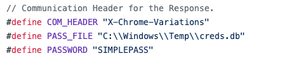
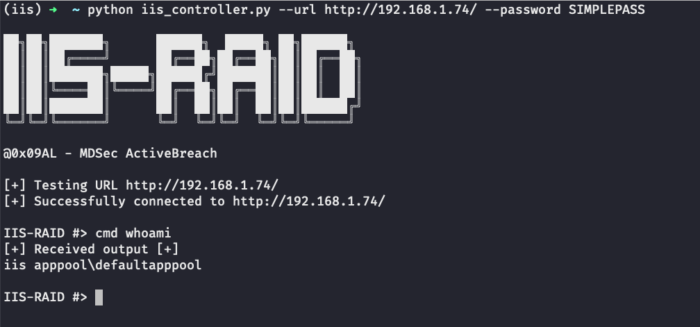

# IIS-Raid

IS Raid is a native IIS module that abuses the extendibility of IIS to backdoor the web server and carry out custom actions defined by an attacker. 

## Documentation

When installed, IIS-Raid will process every request and method, check if the X-Password header exists and compare it against the hardcoded value.
In case the value specified by the header doesn't match the password, the request will continue normally without giving any indications of the backdoor. 
If the header value matches the password, it will search for the communication header and extract its content. Additionally, it will base64 decode it, compare it against the predefined commands and process the instructions if any. 

Four arguments are implemented on the script:
* --url : The URL that will be used to communicate with the backdoor. [Required]
* --password - The pre-shared password on the backdoor [Required]
* --header - The header to use for communication in case it was changed from the default one.
* --method - Change the method to either GET or POST.

Some of the features that are currently implemented in this version are:
* Interactive Command Execution - Allows the execution of commands and retrieve the output.
* Shellcode Injection - Extend functionality by injecting custom shellcode.
* Web Password Extractor - Extract passwords from Web Forms in clear-text.

## Customisation

Before using and compiling the module, you need to change some of the options. To authenticate to the backdoor, the controller uses a pre-shared password with the module. As this is the only mechanism preventing someone else from accessing the backdoor, the default password must be changed.

Apart from the password, other backdoor options can be modified on the Functions.h file:

The COM_HEADER definition is the header name used to perform the communication between the backdoor and the controller.
The PASS_FILE definition is the file path where the extracted credentials from the web forms will be saved.
The PASSWORD definition is the password that will be used to authenticate to the backdoor.

## More info

For more information refer to https://mdsec.co.uk/blog/

### Demo Video

https://www.youtube.com/watch?v=jbxEWOXecuU&feature=youtu.be

### Screenshot

